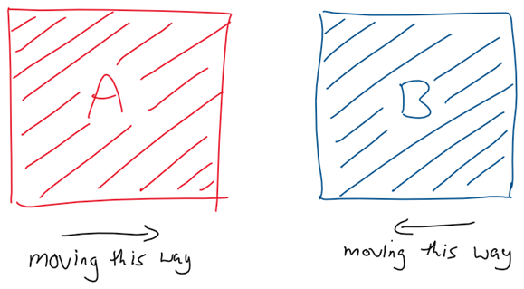
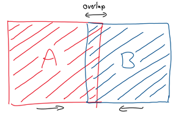
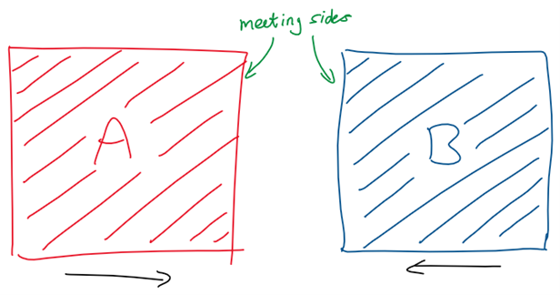
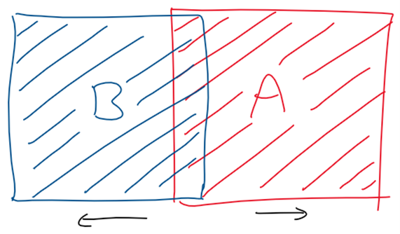
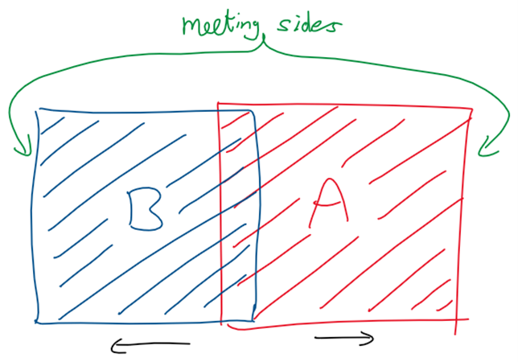
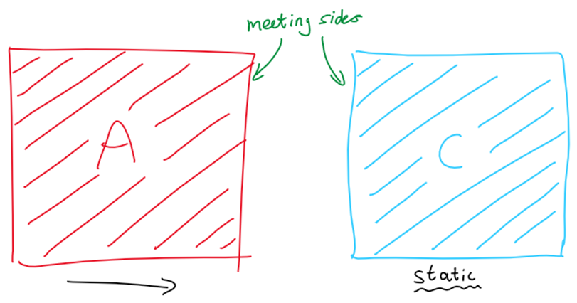
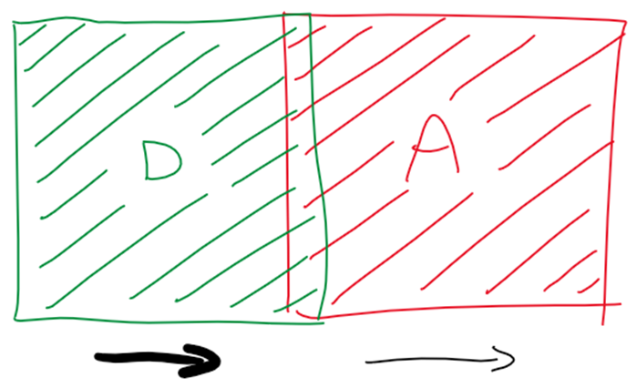
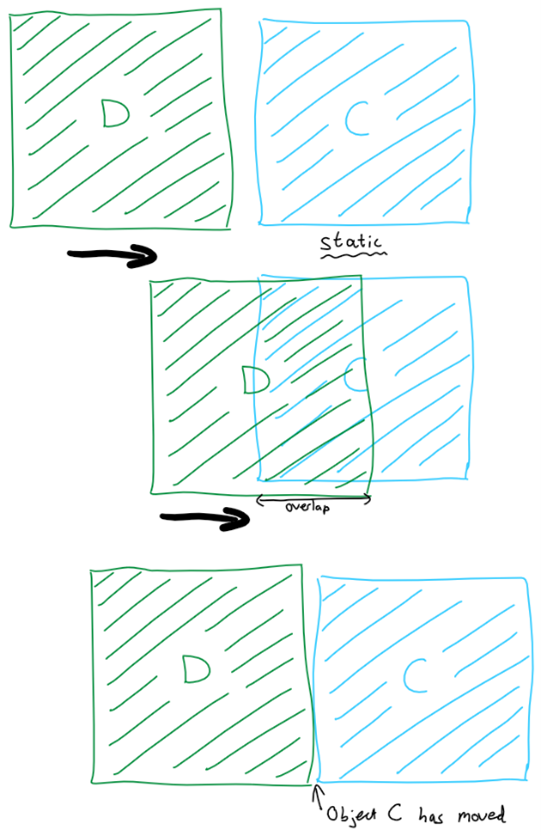
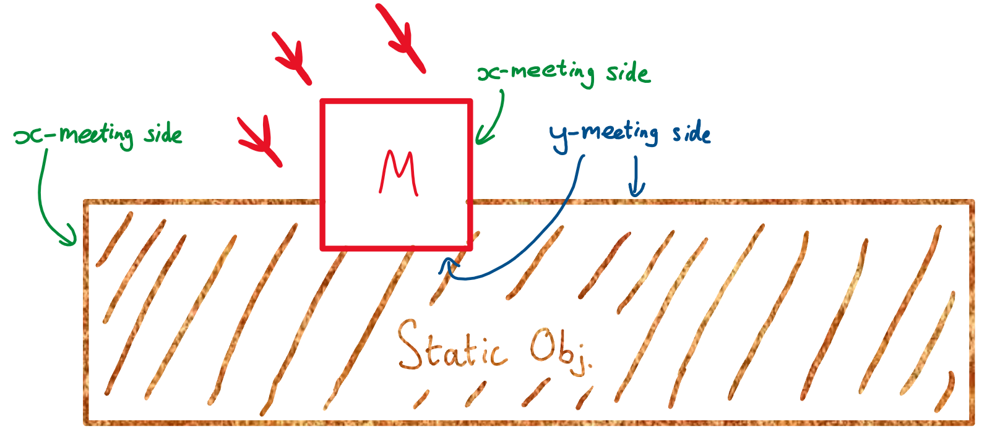

# Collision Detection

This is how the collision system in the game works. Most of the code doing these processes should be in the Hitbox class as it needed to be extracted so that all physical bodies can inherit/encapsulate it.

Note: all scenarios here will be discussed and analysed in a purely horizontal scenario, however this will happen in the exact same way in the vertical direction as all hitboxes will be rectangles.

_Note 2: pretty much this entire system was designed in the VnA in the queue waiting for chicken so if there are any errors or edge cases we might have missed, so be it._

## The Problem

The basic problem is the above where two bodies are moving in such a way that they meet together and form an overlap as seen below:

## Meeting Sides

The first aspect is to check that there is an overlap between two objects. In this scenario, we know that the previous positions of these two objects were non overlapping (as any overlaps would have been fixed through this process on the previous increment of the game loop) and by adding the velocity vectors to each object causes this overlap.

The goal is the have the objects move back so that they are no longer overlapping but still touching. As we don’t want a small gap between them when there is more space to move.

Our solution was to define the ‘meeting sides’ of the objects i.e. the side of each shape that would have touched at some point in time, were this to be a infinitely fluid movement.

You cannot just move the two objects in the way that makes the smallest distance due to this edge case:

If object B and object A are going fast enough in opposite directions, it is possible for the leap between frames to be great enough that they are already more than half through one another. A simplistic method of collision detection would then leave B on the left and A on the right, resulting in them clipping through each other. This is not wanted.

In the meeting sides method, we see that they still remain far away:

Therefore we can still move the objects back to where they need to be.

## How to find meeting sides

My first intuition for how to find the meeting sides was the velocity of the object. If the object was moving rightwards, then the right side would have to be the meeting side. However this is not necessarily true.

In the above diagram, we see that there can be a static object with 0 velocity. This means that we would not be able to know its meeting side from its velocity. However we know that A will collide with C and visually we can see that the meeting side will be the left of C.

It is also possible that the velocity can just be wrong in the case below:

Even if two objects are moving in the same direction they could still collide as seen above if one of them has a greater magnitude of velocity seen as the thicker movement arrow. Here D collides with A even though their velocities act in the same direction.

Therefore the way to calculate meeting sides is the take the sum of the velocities and use that. If the velocity is rightwards then the object initially on the left will have a meeting side on its right, and vice-versa for the right object. We will always be able to tell which object was initially on which side as before the velocity was added they were not overlapping and therefore were side by side.

## How to find final position from meeting sides

The initial response for how to apply the meeting sides was to measure the distance between the meeting sides – most commonly just the overlap of the objects – and then you half the distance and move each item opposite to its meeting side by that length. While this would work in most cases there is still a scenario where this would cause an issue.

In the above diagram is a system where there is an object that moves and overlaps with a stationary object. When they overlap, the distance between meeting sides is calculated and they are both moved by half of it in opposite directions to counter it. However this results in C – a supposedly static object – changing its position, which therefore must be wrong. This means that instead the overlap should not be split into halves, but instead split into two parts dependents on the ratio between the velocities of the two objects. Then in this scenario, object C would get no correctional displacement as they make up 0% of the net velocity.

## Known problems as of writing version 1 of this

Now that I have finished writing this, I have thought of a couple extra edge cases:

- There is still the possibility that there are two objects moving opposite to each other so quickly that in one frame of the game loop they pass straight through each other. This would mean that they never overlap and therefore never collide. As of right now I cannot think of an easy way to fix this in a non-brute-force calculation method.

- The other potential problem would be if there were three objects where one was in the middle and the other two were both moving towards the centre but from different sides. In this scenario I picture the calculation for the first collision being done, causing these two objects to then be assumed to be not overlapping. However, then during the same frame calculation period, the other object would calculate the collision with the middle object causing the middle object to move back (and therefore into the first object it collided with). Since this is still the same game loop, there would not be another calculation between these objects and the game would continue. This would mean that a big assumption made – that the objects are definitely not overlapping before the movement – is no longer true, and I assume this could wreak havoc with potential bugs and errors.

The main point is that these scenarios should both be pretty uncommon and also they shouldn’t break everything else so it is not too important as of now.

## Additions after writing the code (for the first time)

I am now writing this after I have finished building what seems to be a working collision detection system. It is possible that there are problems with it that just haven't appeared in the multitude of tests I have done (walking the player into the sides of one platform :|), but when building I still found that there were a couple of cases that I did not account for.

### Better method of checking overlaps

Before writing the first version of this I thought I new how to build a fairly good function to check if two rectangles were overlapping, but this ended up causing problems because I assumed a malperforming function was working, causing me to try to debug working areas of code. Once I realised this was the problem, I decided it would be worth it to just look up the most efficient method and found [this article](https://www.geeksforgeeks.org/find-two-rectangles-overlap/). I won't explain it here because the link is literally right there, so I'll just add that the difference between theirs and mine is that our classes record the top-left position and the dimensions instead of the top-left and bottom-right positions. But this can easily be accounted for.

### Missed edge case with diagonal movement

Another problem was one that I had missed since I had assumed that I could simplify the problem to horizontal and vertical independence without loss of generality. However the following diagram presents the problem I ran into.

In the diagram, moving object M is moving in a diagonal direction toward the static platform-like object. The problem was that I would work out the displacement required to undo the overlap for both x and y direction and then apply both. However this would cause the box in this case to jump all the way to the left of the platform, because it needs to move opposite to its meeting side.

What we actually want is to apply the horizontal velocity with no adjustments and only correct the vertical displacement. To do this I would compare the meeting side distances for each axis. I would then choose to only apply the correctional displacement of the lowest non-zero axis so that the moving object would move the shortest distance to undo the overlap. While technically this is not how it would work in reality (_Consider if the horizontal displacement was very large, there would be a massive difference in meeting sides, and a small vertical displacement would then lead to still popping out vertically due to the distance being lower. When in reality the object should probably go all the way back horizontally._), it makes sense as a fix for most cases.

## TL;DR

Here is the problem:

- Two objects are not overlapping
- The respective velocities are added to these objects
- The objects are now overlapping
- They should not be and now need to be moved

Here are the steps to take to correct it:

- Find meeting sides of object
  - Calculate net velocity
  - If net velocity is rightwards, then choose right side of left object and left side of right object
  - Opposite if net velocity is leftwards
- Move objects
  - Calculate percentage of each velocity out of the total added magnitude of both vectors
  - Calculate distance between meeting sides
  - Calculate correctional displacement by taking the percentage of the distance for each object both calculated earlier
  - Set direction of these distances to opposite the side the meeting side is on
  - Apply the lowest non-zero correctional distance only to the object to undo the overlap
