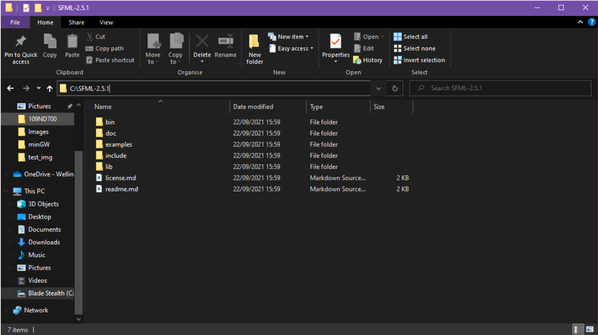
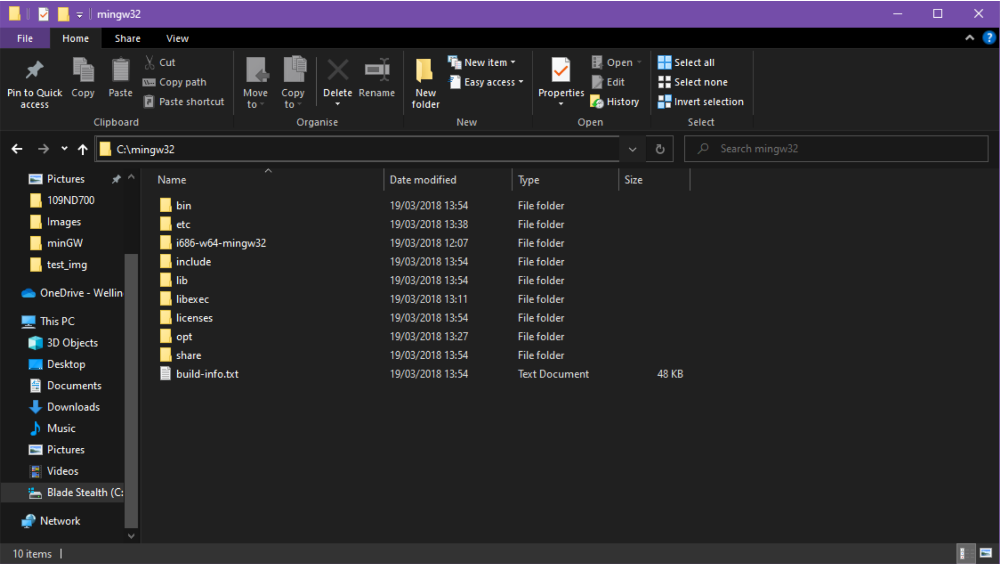

# Setting up for Welly Comp Sci

## Prerequisites

- VS Code
- Git (Github Desktop is optional)

## Downloads (from Google Drive)

- SFML
- minGW

## Steps

0. Steps to set up
1. If you have installed minGW previously, uninstall all versions of it.
2. Clone the repository from Github and open it in VS Code, please contact verte@wellingtoncollege.org.uk or maclaig@wellingtoncollege.org.uk if you need access to the repository
3. Download SFML + minGW from our [Google Drive Link](https://drive.google.com/drive/folders/1wvk_uyQrrfUtwQ7ta4-MBrA2xah8IlzY?usp=sharing)
4. Extract the downloaded folders to C:/ (make sure to keep all the names the same)
5. It should look like the screenshots below.

6. Create key bindings for VS Code - [video tutorial link](https://youtu.be/vTHb_nJHNwA)
7. Run the program with F9!
